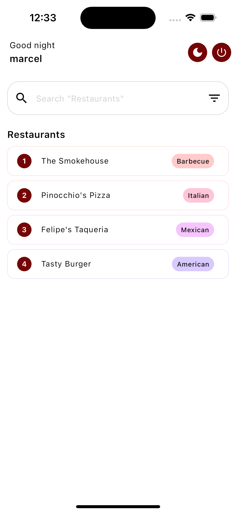
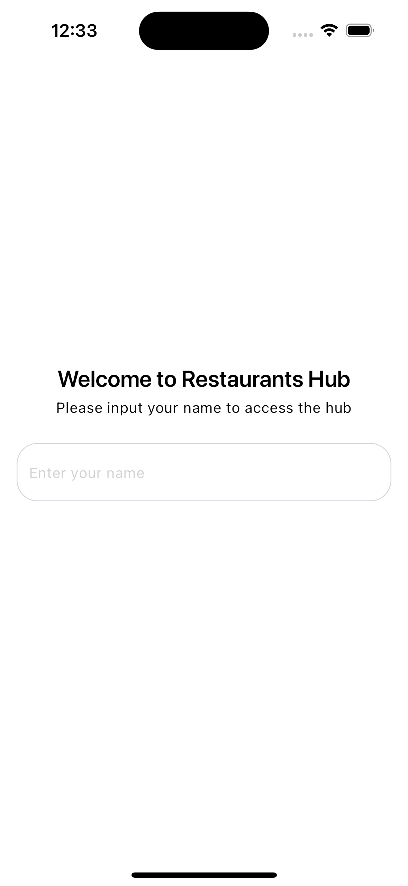
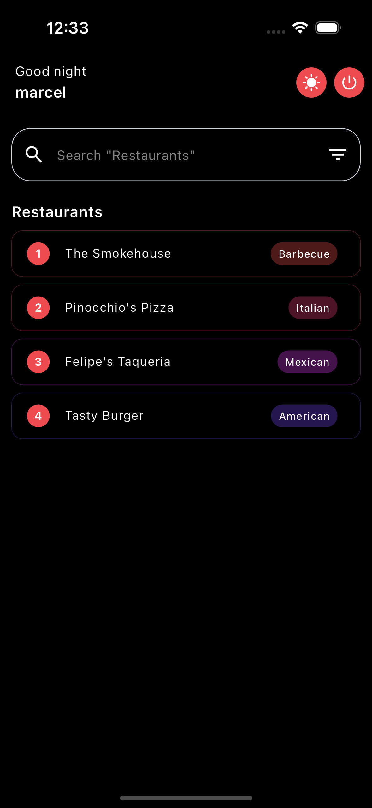

<div align="center">
   

## Fate Date

<strong>Fate date demo (Go on a date, Let Fate decide)</strong>

<sub>Built by <a href="https://twitter.com/_Captured_Heart">Nkpozi Marcel Kelechi</a></sub>
<br />

## AN INTRO VIDEO OF THE APP

</div>

---

## Getting Started

After cloning,

### FVM setup

it runs on flutter version: flutter: ">=3.22.1", dart: ">=3.3.4 <4.0.0",

Install `fvm` if not already installed.

```bash
dart pub global activate fvm
```

Install the local `flutter` version.

```bash
fvm install
```

---

# Key Features

1. Search:

   - Make a query by either searching the "restaurants" or "cuisine" name

2. List:

   - Displayed a list of restaurants from a data (List of Map<String, dynamic>) provided in the documentation  [Json link](drive.google.com/file/d/1uN_gk2oJ5F4JMAsbjThTmER3LffulsZ2/view?usp=sharing)
  
3. Theme mode
   
   - Light and dark mode feature available

## UI Shots

<div style="text-align: center">
  <table>
    <tr>
      <td style="text-align: center">
        
      </td>
      <td style="text-align: center">
        
      </td>
      <td style="text-align: center">
        
      </td><td style="text-align: center">
        
      </td>
    </tr>
  </table>
</div>

## Tools

- [flutter_riverpod](https://pub.dev/packages/flutter_riverpod): A reactive caching and data-binding framework. Riverpod makes working with asynchronous code a breeze.

